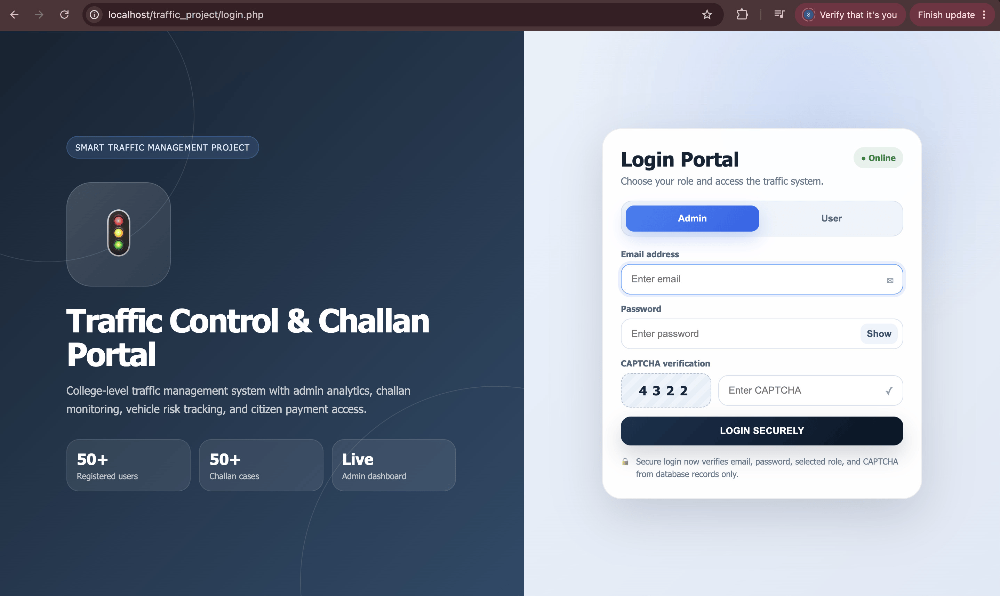
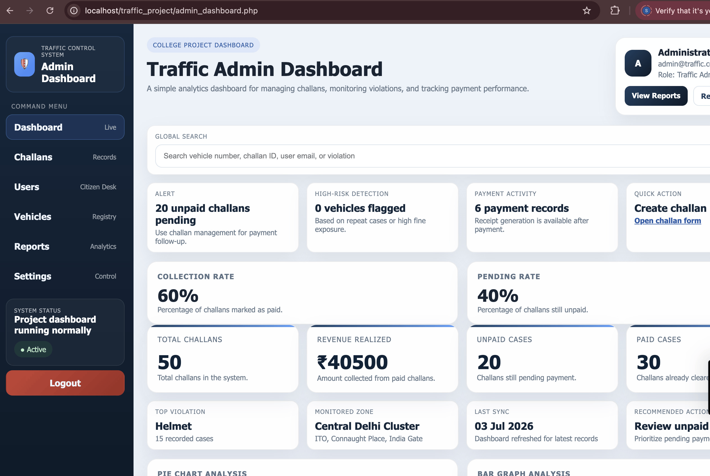
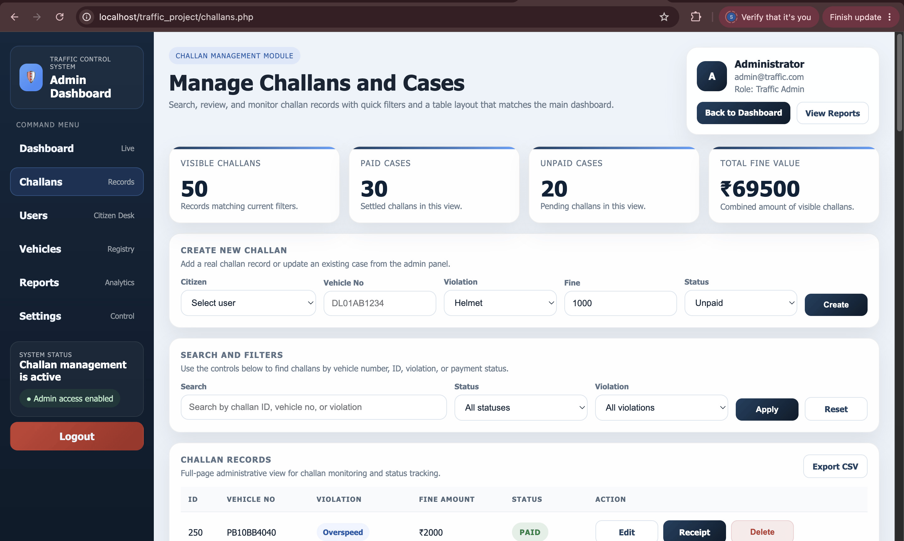
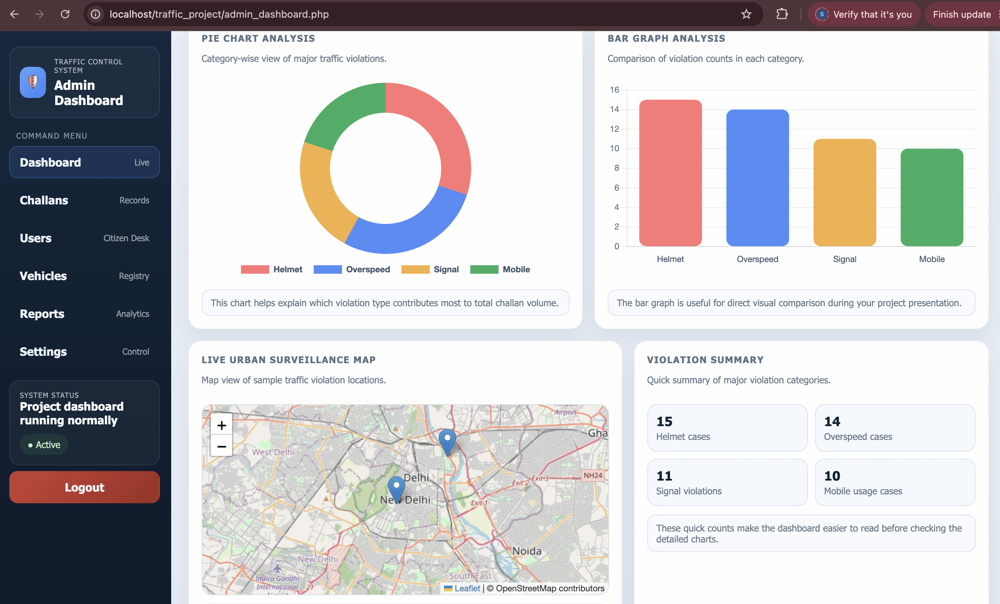
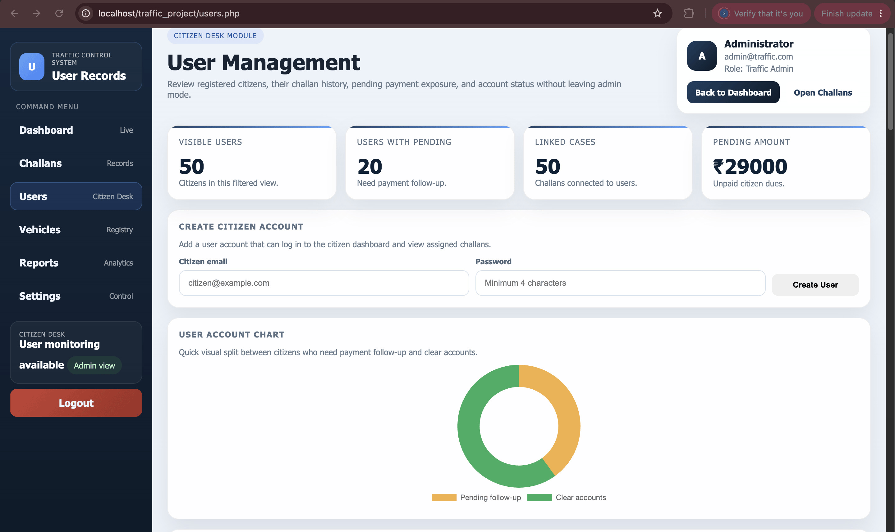
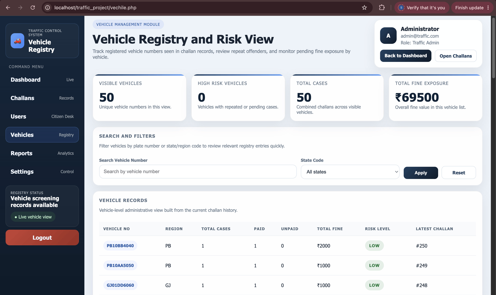
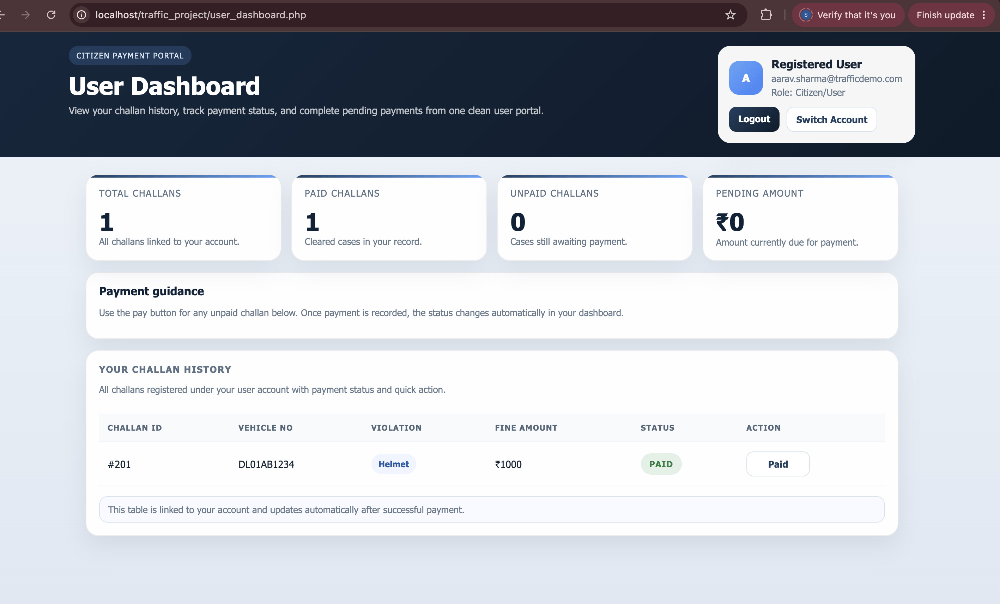

# 🚦 Smart Traffic Violation Detection & E-Challan Management System

## Overview
A web-based traffic management platform developed using PHP, MySQL, HTML, CSS, and JavaScript. The system automates traffic violation tracking, e-challan generation, vehicle management, payment monitoring, analytics reporting, and citizen services.

## Features

### Admin Module
- Secure Login with CAPTCHA
- Dashboard Analytics
- Challan Management
- User Management
- Vehicle Registry
- Revenue Tracking
- Reports & Statistics

### User Module
- User Dashboard
- Challan History
- Payment Tracking
- Account Management

### Technologies Used
- PHP
- MySQL
- HTML5
- CSS3
- JavaScript
- Chart.js
- Leaflet Maps
- XAMPP

## Project Screenshots

### Login Portal

### Admin Dashboard

### Challan Management

### Dashboard Analytics

### User Management

### Vehicle Registry

### User Dashboard

## Author

**Saksham Sangra**  
B.Tech CSE (AI)
